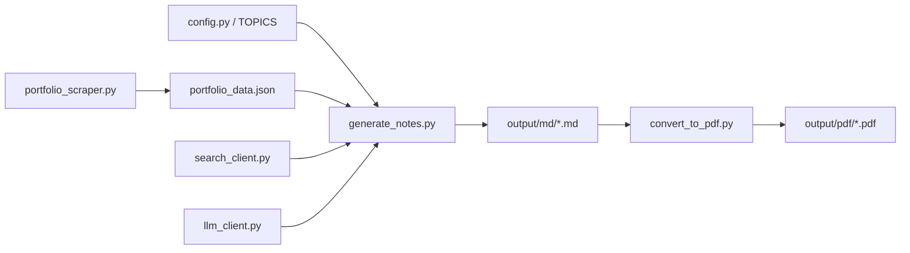

# Architecture

The repository has three sequential stages:

1. Scrape the portfolio with `portfolio_scraper.py` and cache the raw data in `portfolio_data.json`.
2. Generate study notes with `generate_notes.py`, which calls the local LLM and optional search context.
3. Convert the generated Markdown into PDFs with `convert_to_pdf.py`.

## File Responsibilities

- `config.py` holds environment-driven settings, output paths, and topic/project lists.
- `llm_client.py` wraps the OpenAI-compatible client and handles retries.
- `search_client.py` adds optional DuckDuckGo context when enabled.
- `prompts/templates.py` stores the chained prompt templates used by the notes pipeline.
- `templates/notes_style.css` controls the PDF styling.
- `portfolio_scraper.py` is the single scraper entrypoint kept in the repo.

## Data Contracts

- `portfolio_data.json` stores scraped skills and projects.
- Markdown files in `output/md/` are the handoff between generation and PDF conversion.
- PDFs in `output/pdf/` are the final publishable output.