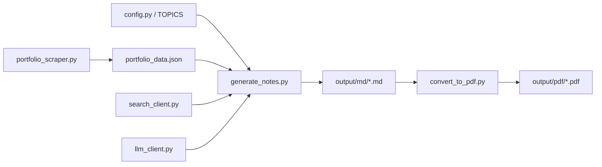

# Architecture

The repository has three sequential stages:

1. Scrape the portfolio with `portfolio_scraper.py` and cache the raw data in `portfolio_data.json`.
2. Generate study notes with `generate_notes.py`, which calls the local LLM and optional search context.
3. Convert the generated Markdown into PDFs with `convert_to_pdf.py`.

## File Responsibilities

- `config.py` holds environment-driven settings, output paths, topic themes, and model discovery.
- `llm_client.py` wraps the OpenAI-compatible client, handles retries, and iterates model candidates.
- `search_client.py` adds optional DuckDuckGo context when enabled (lazy import).
- `prompts/templates.py` stores the chained prompt templates used by the notes pipeline.
- `convert_to_pdf.py` controls PDF styling, per-topic themes, adaptive code-block sizing, and cover pages.
- `portfolio_scraper.py` is the single scraper entrypoint (Playwright, fixed section indices).
- `generate_notes.py` runs the multi-stage pipeline with thread-pooled parallel LLM calls.
- `run_all.py` orchestrates the end-to-end flow: scrape → generate → convert per topic.

## Data Contracts

- `portfolio_data.json` stores scraped skills, projects, and experience.
- Markdown files in `output/md/` are the handoff between generation and PDF conversion.
- PDFs in `output/pdf/` are the final publishable output.
- `output/md/.note_state.json` tracks per-topic portfolio hashes for staleness detection.

## Pipeline Stages (generate_notes.py)

1. **Stage 1A — Fundamentals & Mental Model** (blocking, depends on search context)
2. **Stage 1B — Internals & Real-World Patterns** (parallel)
3. **Stage 2 — ASCII Architecture Diagrams** (parallel)
4. **Stage 2.5 — Portfolio Relevance** (parallel)
4. **Stage 2.7 — Common Pitfalls & Debugging** (parallel)
5. **Stage 2.8 — Quick Reference Cheat Sheet** (parallel)
6. **Stage 3 — Interview Questions** (parallel)

All stages after 1A run concurrently via `ThreadPoolExecutor(max_workers=5)`.
Results are stitched directly — no extra LLM merge pass.

## Staleness Detection

A topic regenerates when:
- `output/md/<slug>.md` doesn't exist
- No entry in `.note_state.json` (predates tracking → treated stale once)
- Portfolio content relevant to that topic has changed (hash mismatch)

Relevant content = any project or experience entry whose name, description, stack, or highlights mention the topic.